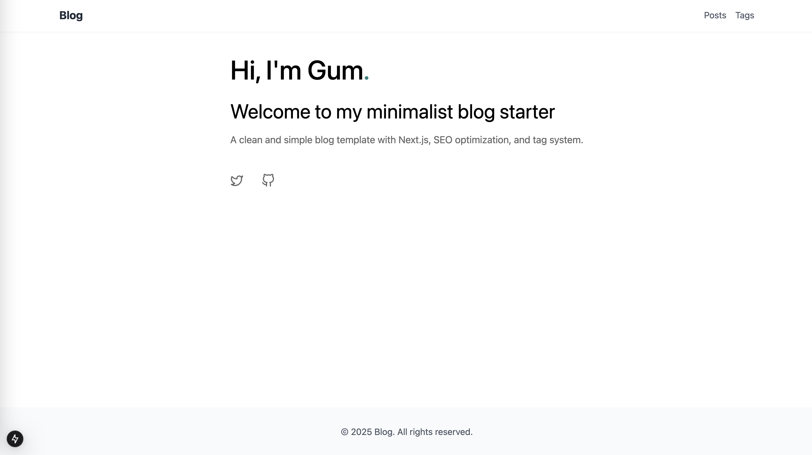
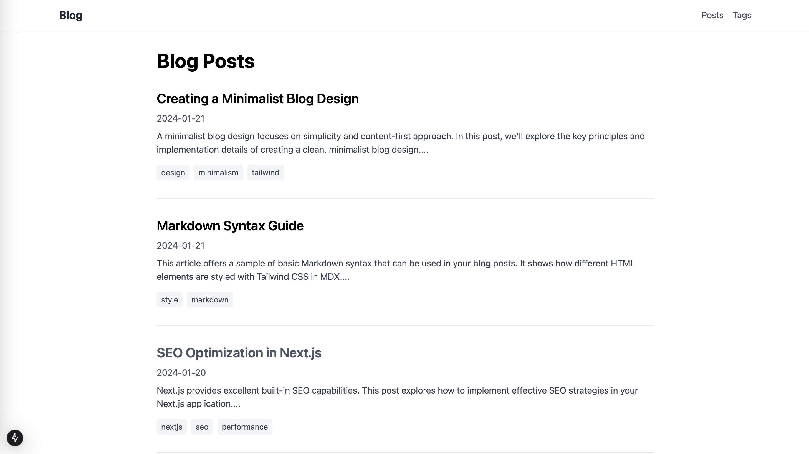
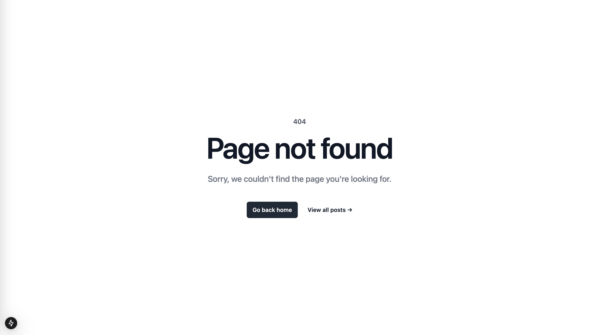

# Next.js SEO Blog Starter

A modern, SEO-optimized blog starter template built with Next.js 14, TypeScript, and Tailwind CSS. This template focuses on performance, SEO best practices, and a great developer experience.

[](https://vercel.com/new/clone?repository-url=https://github.com/GanLiuuuu/nextjs-seo-blog-starter)

## Preview


*Home page with featured posts and tag filtering*


*Individual post page with responsive typography*


*Custom 404 page with a clean design*

## Features

- **⚡️ Next.js 14**: Utilizing the latest features including App Router and Server Components
- **🎯 SEO Optimized**: Built-in metadata optimization, JSON-LD, and OpenGraph tags
- **📱 Responsive Design**: Beautiful and responsive design using Tailwind CSS
- **🎨 Modern Styling**: Clean and minimal design with Tailwind CSS
- **📝 Markdown Support**: Write your blog posts in Markdown with frontmatter
- **🏷️ Tag System**: Organize your content with tags
- **📊 Analytics Ready**: Easy integration with your preferred analytics tool
- **🔍 Search Engine Friendly**: Optimized for search engines out of the box
- **🚀 Fast Page Loads**: Optimized for Core Web Vitals
- **📱 Mobile-First**: Designed with mobile-first approach
- **🎨 Beautiful Pages**: 
  - Clean and modern home page layout
  - Responsive post pages with optimal reading experience
  - Stylish 404 page with helpful navigation

## Quick Start

### Deploy on Vercel (Recommended)

The easiest way to deploy your blog is to use the [Vercel Platform](https://vercel.com):

1. Click the "Deploy with Vercel" button above
2. Follow the deployment steps
3. Your blog will be live in minutes!

### Local Development

```bash
# Clone the repository
git clone https://github.com/GanLiuuuu/nextjs-seo-blog-starter.git my-blog

# Navigate to the directory
cd my-blog

# Install dependencies
npm install

# Start the development server
npm run dev
```

Visit [http://localhost:3000](http://localhost:3000) to see your blog.

## Project Structure

```
nextjs-seo-blog-starter/
├── app/                   # Next.js 14 app directory
│   ├── page.tsx          # Home page
│   ├── posts/            # Post pages
│   └── not-found.tsx     # Custom 404 page
├── components/           # Reusable React components
├── content/             # Blog posts in markdown
├── lib/                 # Utility functions and data fetching
├── public/              # Static assets
│   └── images/          # Images including previews
└── styles/              # Global styles and Tailwind config
```

## Writing Content

Create new blog posts by adding markdown files to the `content/posts` directory:

```markdown
---
title: "My First Blog Post"
date: "2024-01-01"
tags: ["nextjs", "react"]
excerpt: "A brief description of your post"
coverImage: "/images/posts/my-first-post.jpg"  # Optional cover image
---

Your content here...
```

## Customization

### Styling

This template uses Tailwind CSS for styling. Customize the design by modifying:

- `tailwind.config.js` - Theme configuration
- `styles/globals.css` - Global styles
- Individual component styles

### Metadata

Update site metadata in `app/layout.tsx`:

```typescript
export const metadata = {
  title: 'Your Blog Name',
  description: 'Your blog description',
  // ... other metadata
}
```

## Dependencies

- [Next.js 14](https://nextjs.org/)
- [TypeScript](https://www.typescriptlang.org/)
- [Tailwind CSS](https://tailwindcss.com/)
- [React](https://reactjs.org/)

## Contributing

Contributions are welcome! Please feel free to submit a Pull Request.

## License

MIT License - feel free to use this template for your own blog!

## Support

If you find this template helpful, please consider giving it a ⭐️ on GitHub!
